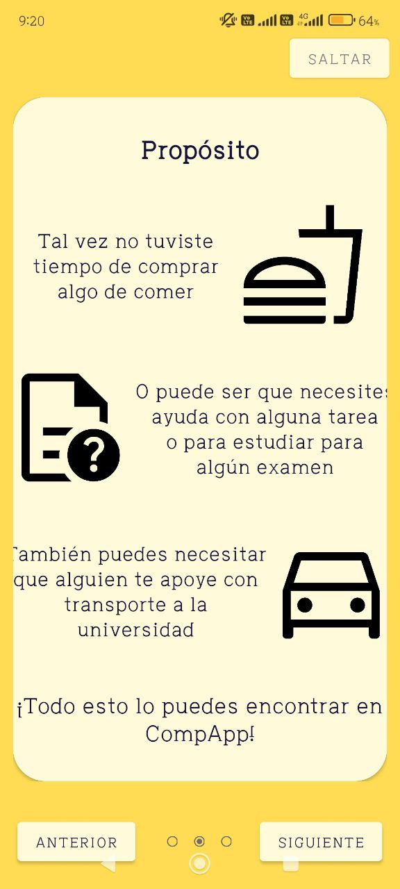
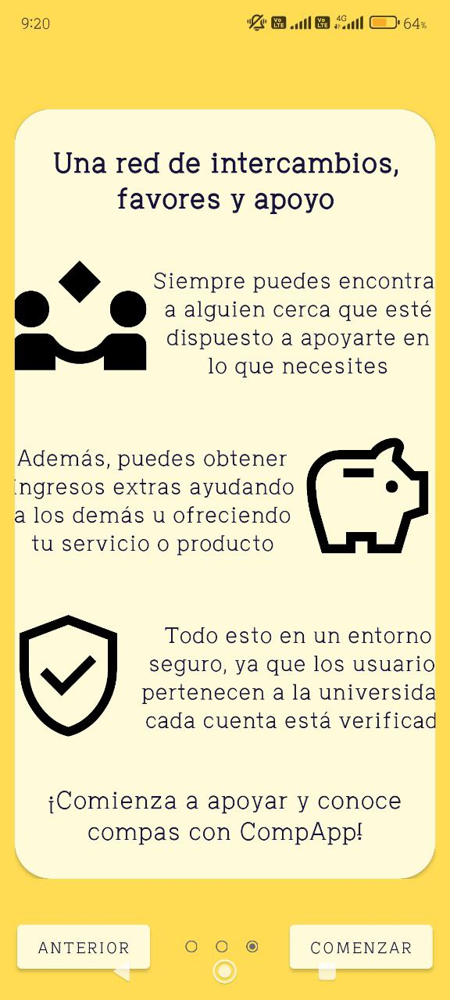
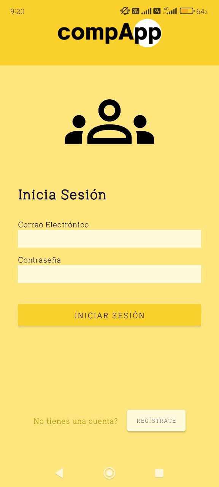
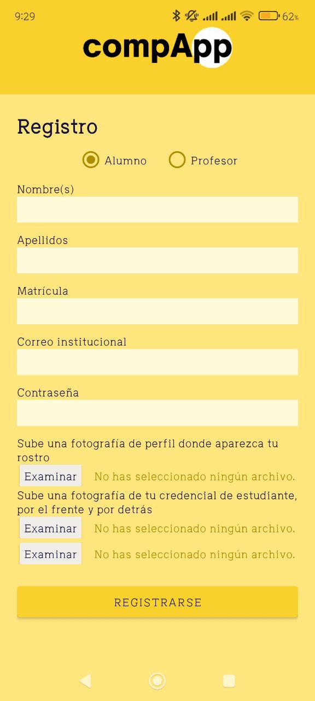
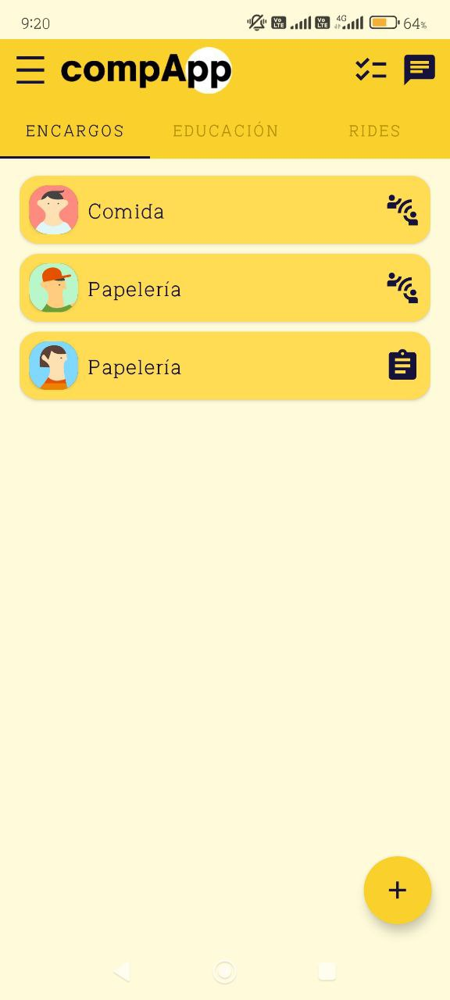
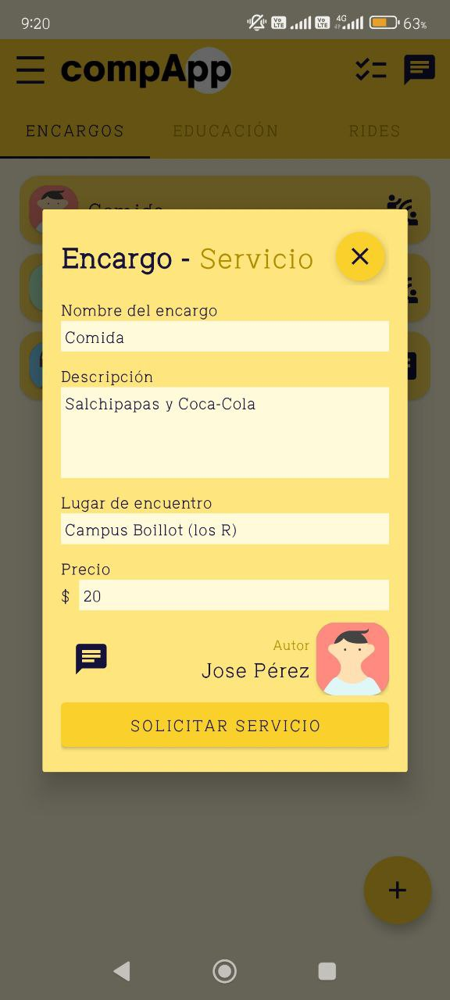
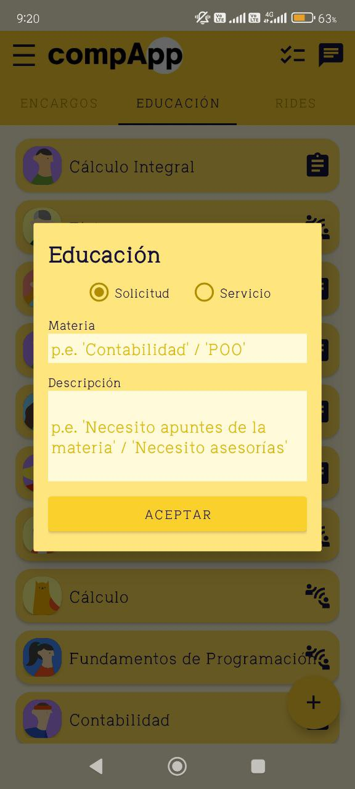
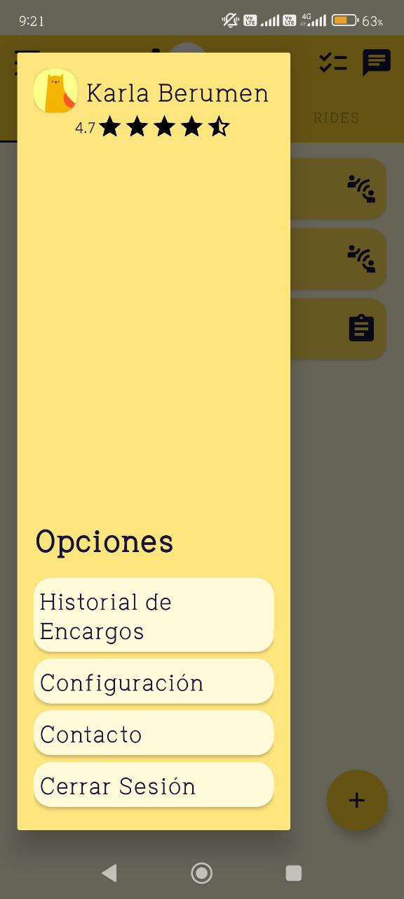
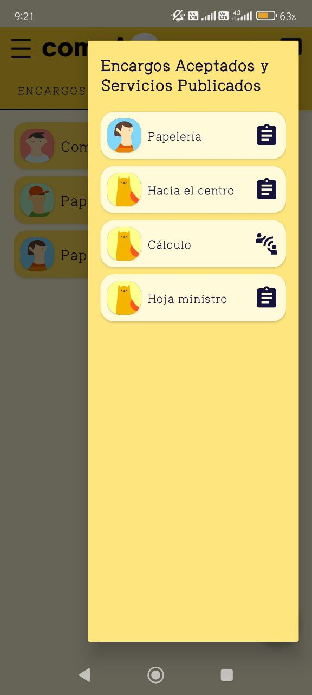
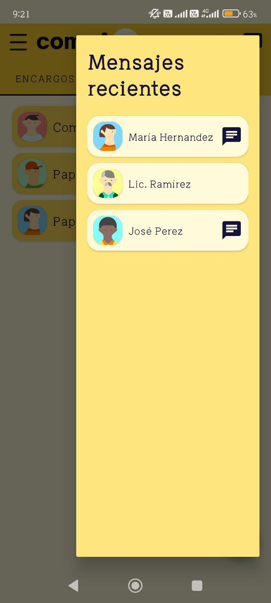

# CompApp 🤝

CompApp is a cross-platform application (Android & iOS) built using **Kotlin Multiplatform**. It allows users to request, accept favors, communicate through messages (in progress), and rate other users (in progress). This project was developed for the **INNOVATEC 2024** competition and reached the **regional stage**. It connects to a backend developed by [Kosail](https://github.com/kosail) (backend at this [repository](https://github.com/kosail/CompApps-Backend-Server)) through **REST API**.

<div align="center">
  
</div>

## Features 💡
* User Authentication: Users can register and log in through a secure REST API.
* Favor Requests: Users can post and accept favor requests.
* User Communication: In-progress feature to allow users to chat and coordinate.
* User Rating: In-progress feature to allow users to rate each other after completing a favor.

## Technologies Used 🚀
* Kotlin Multiplatform: Shared codebase for Android and iOS.
* Jetpack Compose (Material 3): Modern and flexible UI framework.
* Ktor Client: For handling HTTP requests (REST API integration).
* Coil: Image loading and caching.

## Requirements 📝
* Android Studio
* Kotlin 2.0.0
* Gradle 8.7

## How to Run the Project 🏃
* Clone the repository:
  ```
  git clone <repository-url>
  cd CompApp
  ```
* Open the project in Android Studio.
* Select the desired platform:
  - Android: Run on a virtual device or a physical Android phone.
  - iOS: Requires a macOS system with Xcode installed.
* Build and run the project.

## NOTE 📝
**Login is currently dissabled to avoid connection errors and to show application performance**
You can click `log in` button and access the application.

## Dependencies 📋
The project uses the following key libraries:
* Jetpack Compose (Material 3): UI development.
* Ktor Client: HTTP requests (OkHttp for Android, Darwin for iOS).
* Coil: Image loading.
* Navigation Compose: For app navigation.
* Lifecycle ViewModel: State management.

## Screenshots 📷
           

## Future Improvements 🔍
* Implement in-app messaging between users.
* Enable user rating and feedback system.
* Report Post / Report User
* Enhance UI with more Material Design 3 components.

## Contribution 👥
* Feel free to contribute by submitting pull requests or reporting issues.
* Since this was only a project for Innovatec 2024, it is possible that it will not be continued and will instead develop other projects.

## License 🪪
This project is licensed under the GNUv3 LICENSE.
